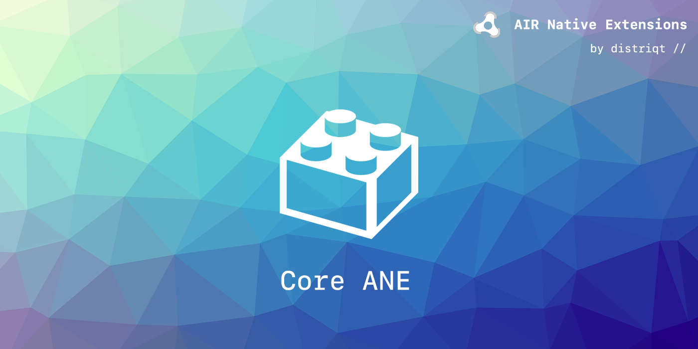

built by [distriqt //](https://airnativeextensions.com) 



# Core 

This extension doesn't provide any functionality in itself but supports some of our other extensions. 
It's a centralised location for some common actions that can cause issues if they are implemented in 
each individual extension. 

There are two main purposes of this ANE:
- Manage global notifications required by multiple ANEs 
- Centralise libraries to avoid conflicts 

Where directed, include this ANE and call the following along with the other ANE initialisations.

```as3
Core.init();
```

## Native Extensions

The highest quality and widest range of Native Extensions for Adobe AIR

With over 40 extensions available, we are the largest provider of native extensions for AIR developers. 
Our mobile solutions allow developers to fast-forward development and focus on building great games and apps.

https://airnativeextensions.com


## License

distriqt retains all copyright.
